# Software Requirements Specification (SRS)

## Greencare AI: Personalized Plant Recommendation and Gardening Assistant

**Version:** 1.0  
**Date:** 27 January 2026

---

## 1. Introduction

### 1.1 Purpose

To specify the requirements for "Greencare AI," a system facilitating smart gardening through AI-powered plant recommendations and disease diagnosis.

### 1.2 Scope

The software covers:

- Plant recommendation logic based on environmental parameters
- Image processing for disease detection
- User management and profiling

### 1.3 Acronyms and Definitions

| Term | Definition                                      |
| ---- | ----------------------------------------------- |
| SRS  | Software Requirements Specification             |
| NPK  | Nitrogen-Phosphorus-Potassium (soil nutrients)  |
| CNN  | Convolutional Neural Network                    |
| YOLO | You Only Look Once (object detection algorithm) |
| API  | Application Programming Interface               |

---

## 2. Overall Description

### 2.1 Product Perspective

A modular web application with a Python-based microservice architecture consisting of:

- Frontend (React.js)
- Backend API (Flask)
- AI Models (Transformer, YOLOv8)
- Database (MongoDB)

### 2.2 User Characteristics

Non-technical users with basic smartphone/web literacy who are interested in gardening.

### 2.3 Constraints

- Must run on standard web browsers
- Image upload limit: 5MB
- Requires active internet connection for AI inference

### 2.4 Assumptions

- Users will provide accurate soil and environmental data
- Images uploaded will be of plant leaves/stems

---

## 3. Functional Requirements

| ID        | Requirement          | Description                                                     | Priority |
| --------- | -------------------- | --------------------------------------------------------------- | -------- |
| **FR-01** | User Registration    | System shall allow users to create a profile                    | High     |
| **FR-02** | Environmental Input  | System shall accept N, P, K, pH, and Temperature values         | High     |
| **FR-03** | Plant Recommendation | System shall display top 3 plant matches with confidence scores | High     |
| **FR-04** | Image Upload         | System shall allow image upload (JPG/PNG, max 5MB)              | High     |
| **FR-05** | Disease Diagnosis    | System shall identify diseases and suggest remedies             | High     |

---

## 4. Non-Functional Requirements

| ID         | Requirement | Description                            | Target         |
| ---------- | ----------- | -------------------------------------- | -------------- |
| **NFR-01** | Performance | Recommendation inference must complete | < 2 seconds    |
| **NFR-02** | Reliability | System availability during daytime     | 99%            |
| **NFR-03** | Usability   | UI must be responsive                  | Mobile/Desktop |
| **NFR-04** | Accuracy    | Disease model accuracy                 | > 85%          |

---

## 5. Use Case Diagram

```mermaid
graph TB
    subgraph Actors
        G[🧑‍🌾 Gardener]
        A[👨‍💼 Admin]
    end

    subgraph "Use Cases"
        UC1[Register Profile]
        UC2[Input Soil Data]
        UC3[Get Recommendation]
        UC4[Upload Leaf Photo]
        UC5[View Diagnosis]
        UC6[View Care Plan]
        UC7[Manage Plant Database]
    end

    G --> UC1
    G --> UC2
    G --> UC3
    G --> UC4
    G --> UC5
    G --> UC6
    A --> UC7

    UC2 --> UC3
    UC4 --> UC5
    UC5 --> UC6
```

---

## 6. Activity Diagram

