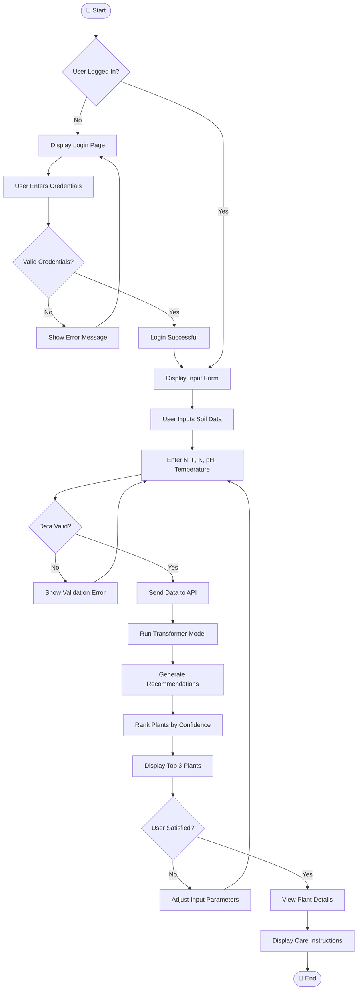

# Activity Diagram

## Greencare AI - Plant Recommendation Flow

### Scenario: User Gets Plant Recommendations

---

## Activity Flow Description

| Phase              | Activities                                           |
| ------------------ | ---------------------------------------------------- |
| **Authentication** | Check login status → Login if needed                 |
| **Data Input**     | Display form → User enters N, P, K, pH, Temperature  |
| **Validation**     | Validate input ranges → Show errors if invalid       |
| **AI Processing**  | Send to API → Run Transformer → Generate scores      |
| **Output**         | Rank plants → Display top 3 → Show care instructions |

### Data Validation Rules

| Field          | Valid Range |
| -------------- | ----------- |
| Nitrogen (N)   | 0 - 140     |
| Phosphorus (P) | 5 - 145     |
| Potassium (K)  | 5 - 205     |
| pH             | 3.5 - 9.5   |
| Temperature    | 10°C - 45°C |
