# Activity Diagram

## Greencare AI - Plant Recommendation Flow

### Scenario: User Gets Plant Recommendations

```mermaid
flowchart TD
    A([🌱 Start]) --> B{User Logged In?}

    B -->|No| C[Display Login Page]
    C --> D[User Enters Credentials]
    D --> E{Valid Credentials?}
    E -->|No| F[Show Error Message]
    F --> C
    E -->|Yes| G[Login Successful]
    G --> H

    B -->|Yes| H[Display Input Form]
    H --> I[User Inputs Soil Data]
    I --> J["Enter N, P, K, pH, Temperature"]

    J --> K{Data Valid?}
    K -->|No| L[Show Validation Error]
    L --> J

    K -->|Yes| M[Send Data to API]
    M --> N[Run Transformer Model]
    N --> O[Generate Recommendations]
    O --> P[Rank Plants by Confidence]
    P --> Q[Display Top 3 Plants]

    Q --> R{User Satisfied?}
    R -->|No| S[Adjust Input Parameters]
    S --> J
    R -->|Yes| T[View Plant Details]
    T --> U[Display Care Instructions]

    U --> V([🏁 End])
```

---

## Activity Flow Description

| Phase              | Activities                                           |
| ------------------ | ---------------------------------------------------- |
| **Authentication** | Check login status → Login if needed                 |
| **Data Input**     | Display form → User enters N, P, K, pH, Temperature  |
| **Validation**     | Validate input ranges → Show errors if invalid       |
| **AI Processing**  | Send to API → Run Transformer → Generate scores      |
| **Output**         | Rank plants → Display top 3 → Show care instructions |

### Data Validation Rules

| Field          | Valid Range |
| -------------- | ----------- |
| Nitrogen (N)   | 0 - 140     |
| Phosphorus (P) | 5 - 145     |
| Potassium (K)  | 5 - 205     |
| pH             | 3.5 - 9.5   |
| Temperature    | 10°C - 45°C |
