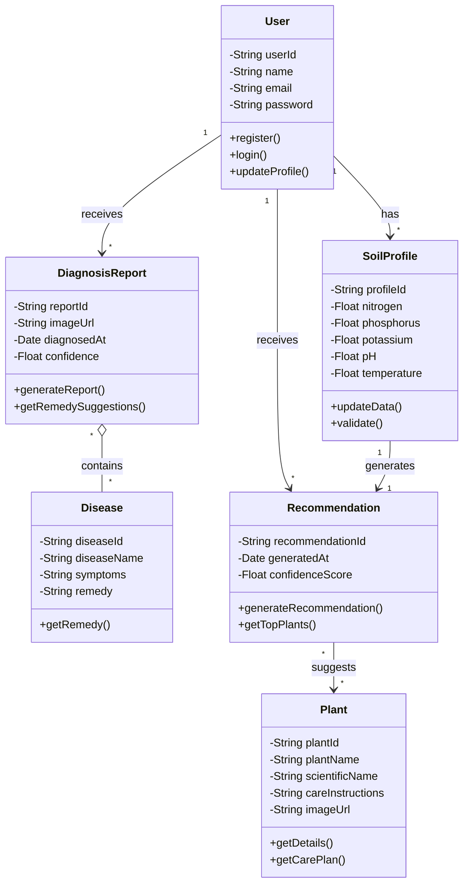

# Class Diagram

## Greencare AI

### Classes Identified

1. **User** - System user/gardener
2. **SoilProfile** - Environmental data
3. **Plant** - Plant information
4. **Disease** - Disease information
5. **Recommendation** - Plant suggestions
6. **DiagnosisReport** - Disease detection results

---

## Class Diagram

---

## Class Relationships

| Relationship                 | Description                                         |
| ---------------------------- | --------------------------------------------------- |
| User → SoilProfile           | One user can have multiple soil profiles (1:\*)     |
| User → Recommendation        | One user receives multiple recommendations (1:\*)   |
| SoilProfile → Recommendation | Soil profile generates recommendations (dependency) |
| Recommendation → Plant       | Recommendation suggests multiple plants (_:_)       |
| DiagnosisReport ◇ Disease    | Diagnosis report aggregates diseases (aggregation)  |
