# Component Diagram

## Greencare AI - System Architecture

### Components Overview

```mermaid
graph TB
    subgraph "Client Layer"
        WEB["🌐 Web UI<br>(React.js)"]
        MOB["📱 Mobile UI<br>(PWA)"]
    end

    subgraph "API Layer"
        GW["🔌 API Gateway<br>(Flask)"]
        AUTH["🔐 Auth Service"]
        REC["📊 Recommendation Service"]
        DIAG["🔬 Diagnosis Service"]
    end

    subgraph "Intelligence Layer"
        TF["🤖 Transformer Model<br>(Plant Recommendation)"]
        YOLO["🎯 YOLOv8 Model<br>(Disease Detection)"]
        SHAP["📈 SHAP Explainer"]
    end

    subgraph "Data Layer"
        MONGO[("🗄️ MongoDB<br>(User Data, Plants)")]
        S3["☁️ AWS S3<br>(Images)"]
        REDIS["⚡ Redis<br>(Cache)"]
    end

    WEB --> GW
    MOB --> GW

    GW --> AUTH
    GW --> REC
    GW --> DIAG

    REC --> TF
    REC --> SHAP
    DIAG --> YOLO

    AUTH --> MONGO
    REC --> MONGO
    DIAG --> MONGO
    DIAG --> S3
    GW --> REDIS
```

---

## Component Descriptions

| Component                  | Technology          | Responsibility                      |
| -------------------------- | ------------------- | ----------------------------------- |
| **Web UI**                 | React.js            | User interface for web browsers     |
| **Mobile UI**              | PWA                 | Progressive web app for mobile      |
| **API Gateway**            | Flask               | Route requests, handle CORS         |
| **Auth Service**           | Flask + JWT         | User authentication & authorization |
| **Recommendation Service** | Flask + Transformer | Generate plant suggestions          |
| **Diagnosis Service**      | Flask + YOLOv8      | Detect plant diseases               |
| **Transformer Model**      | PyTorch             | Predict suitable plants             |
| **YOLOv8 Model**           | Ultralytics         | Object detection for diseases       |
| **SHAP Explainer**         | SHAP Library        | Explainable AI features             |
| **MongoDB**                | MongoDB Atlas       | Store users, plants, profiles       |
| **AWS S3**                 | Amazon S3           | Store uploaded images               |
| **Redis**                  | Redis Cloud         | Cache frequent queries              |

---

## Interface Contracts

| Interface     | Endpoint         | Method | Description                |
| ------------- | ---------------- | ------ | -------------------------- |
| User API      | `/api/auth/*`    | POST   | Authentication endpoints   |
| Recommend API | `/api/recommend` | POST   | Get plant recommendations  |
| Diagnose API  | `/api/diagnose`  | POST   | Upload image for diagnosis |
| Plants API    | `/api/plants/*`  | GET    | Fetch plant information    |
