# Deployment Diagram

## Greencare AI - Infrastructure

### Deployment Architecture

```mermaid
graph TB
    subgraph "Client Nodes"
        LAPTOP["💻 Laptop/Desktop<br>Browser (Chrome/Firefox)"]
        PHONE["📱 Smartphone<br>Mobile Browser"]
    end

    subgraph "AWS Cloud"
        subgraph "EC2 Instance"
            subgraph "Docker Containers"
                FLASK["🐍 Flask Container<br>API Gateway"]
                AIRFLOW["🌊 Airflow Container<br>ML Pipeline"]
                TF["🤖 Model Container<br>Transformer + YOLO"]
            end
        end

        subgraph "Database Services"
            MONGO[("🍃 MongoDB Atlas<br>Cluster")]
            S3["☁️ S3 Bucket<br>Image Storage"]
        end

        subgraph "Supporting Services"
            LB["⚖️ Load Balancer<br>ALB"]
            CF["🌐 CloudFront<br>CDN"]
        end
    end

    LAPTOP -->|HTTPS| CF
    PHONE -->|HTTPS| CF
    CF --> LB
    LB --> FLASK

    FLASK --> TF
    FLASK --> AIRFLOW
    FLASK --> MONGO
    FLASK --> S3

    AIRFLOW --> TF
    TF --> MONGO
```

---

## Deployment Specifications

### Client Node

| Specification | Requirement                         |
| ------------- | ----------------------------------- |
| Device        | Laptop, Desktop, Smartphone         |
| Browser       | Chrome 90+, Firefox 88+, Safari 14+ |
| Connection    | Internet (HTTPS)                    |

### AWS EC2 Instance

| Specification | Configuration                     |
| ------------- | --------------------------------- |
| Instance Type | t3.large (or g4dn.xlarge for GPU) |
| vCPU          | 2 (or 4 with GPU)                 |
| Memory        | 8 GB (or 16 GB with GPU)          |
| Storage       | 100 GB SSD                        |
| OS            | Ubuntu 22.04 LTS                  |

### Docker Containers

| Container | Image                | Port |
| --------- | -------------------- | ---- |
| Flask API | python:3.10-slim     | 5000 |
| Airflow   | apache/airflow:2.7.0 | 8080 |
| ML Models | custom:greencare-v1  | 8000 |

### MongoDB Atlas

| Specification | Configuration       |
| ------------- | ------------------- |
| Cluster Tier  | M10 (Shared)        |
| Region        | ap-south-1 (Mumbai) |
| Storage       | 10 GB               |

### AWS S3

| Specification | Configuration             |
| ------------- | ------------------------- |
| Bucket Name   | greencare-images          |
| Region        | ap-south-1                |
| Access        | Private (Pre-signed URLs) |

---

## Network Communication

| Source     | Destination | Protocol | Port  |
| ---------- | ----------- | -------- | ----- |
| Client     | CloudFront  | HTTPS    | 443   |
| CloudFront | ALB         | HTTP     | 80    |
| ALB        | Flask       | HTTP     | 5000  |
| Flask      | MongoDB     | TCP      | 27017 |
| Flask      | S3          | HTTPS    | 443   |
