## Use Case Definition

### Use Case List

| ID    | Use Case                  | Actor    | Description                    |
| ----- | ------------------------- | -------- | ------------------------------ |
| UC-01 | Manage User Profile       | Gardener | Create, update, view profile   |
| UC-02 | Submit Environmental Data | Gardener | Input N, P, K, pH, temperature |
| UC-03 | View Recommended Plants   | Gardener | Get top 3 plant suggestions    |
| UC-04 | Upload Plant Image        | Gardener | Upload leaf/plant photo        |
| UC-05 | View Disease Diagnosis    | Gardener | See disease detection results  |
| UC-06 | View Remedy               | Gardener | Get treatment suggestions      |
| UC-07 | Manage Plant Database     | Admin    | Add/edit plant information     |

### Use Case Diagram

```mermaid
graph LR
    subgraph "System Boundary: Greencare AI"
        UC1["UC-01: Manage Profile"]
        UC2["UC-02: Submit Data"]
        UC3["UC-03: View Plants"]
        UC4["UC-04: Upload Image"]
        UC5["UC-05: View Diagnosis"]
        UC6["UC-06: View Remedy"]
        UC7["UC-07: Manage DB"]
    end

    G[/"🧑‍🌾 Gardener"\]
    A[/"👨‍💼 Admin"\]

    G --> UC1
    G --> UC2
    G --> UC3
    G --> UC4
    G --> UC5
    G --> UC6
    A --> UC7
```

