## Component Diagram

### System Components

```mermaid
graph TB
    subgraph "Client Layer"
        WEB["🌐 Web UI (React.js)"]
        MOB["📱 Mobile UI (PWA)"]
    end

    subgraph "API Layer"
        GW["🔌 API Gateway (Flask)"]
        AUTH["🔐 Auth Service"]
        REC["📊 Recommendation Service"]
        DIAG["🔬 Diagnosis Service"]
    end

    subgraph "Intelligence Layer"
        TF["🤖 Transformer Model"]
        YOLO["🎯 YOLOv8 Model"]
    end

    subgraph "Data Layer"
        MONGO[("🗄️ MongoDB")]
        S3["☁️ AWS S3"]
    end

    WEB --> GW
    MOB --> GW
    GW --> AUTH
    GW --> REC
    GW --> DIAG
    REC --> TF
    DIAG --> YOLO
    AUTH --> MONGO
    REC --> MONGO
    DIAG --> S3
```

### Component Responsibilities

| Component      | Technology  | Responsibility    |
| -------------- | ----------- | ----------------- |
| Web UI         | React.js    | User interface    |
| API Gateway    | Flask       | Request routing   |
| Auth Service   | JWT         | Authentication    |
| Recommendation | Transformer | Plant suggestions |
| Diagnosis      | YOLOv8      | Disease detection |
