## Deployment Diagram

### Infrastructure Overview

```mermaid
graph TB
    subgraph "Client Nodes"
        LAPTOP["💻 Desktop/Laptop"]
        PHONE["📱 Mobile Device"]
    end

    subgraph "AWS Cloud"
        subgraph "EC2 Instance"
            FLASK["🐍 Flask API"]
            MODELS["🤖 AI Models"]
        end
        MONGO[("🍃 MongoDB Atlas")]
        S3["☁️ S3 Bucket"]
    end

    LAPTOP -->|HTTPS| FLASK
    PHONE -->|HTTPS| FLASK
    FLASK --> MODELS
    FLASK --> MONGO
    FLASK --> S3
```

### Deployment Specifications

| Node          | Configuration                   |
| ------------- | ------------------------------- |
| EC2           | t3.large, Ubuntu 22.04          |
| MongoDB Atlas | M10 Cluster                     |
| S3            | Private bucket, pre-signed URLs |
