## Sequence Diagram

### Disease Diagnosis Flow

```mermaid
sequenceDiagram
    autonumber
    actor User as 🧑‍🌾 User
    participant FE as Frontend
    participant API as API Gateway
    participant YOLO as YOLO Model
    participant DB as Database

    User->>FE: Upload Plant Image
    FE->>FE: Validate Format
    FE->>API: POST /diagnose
    API->>YOLO: Predict(image)
    YOLO-->>API: {disease, confidence}
    API->>DB: Save Report
    API-->>FE: JSON Response
    FE-->>User: Display Diagnosis

    opt Disease Found
        User->>FE: Request Remedy
        FE->>API: GET /remedy
        API-->>FE: Remedy Details
        FE-->>User: Display Remedy
    end
```

### Sequence Steps

| Step | Actor    | Action   | Object    |
| ---- | -------- | -------- | --------- |
| 1    | User     | Upload   | Image     |
| 2    | Frontend | Validate | Format    |
| 3    | Frontend | POST     | /diagnose |
| 4    | API      | Predict  | Image     |
| 5    | YOLO     | Return   | Result    |
| 6    | API      | Save     | Report    |
| 7    | Frontend | Display  | Diagnosis |
