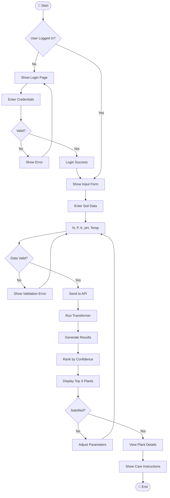

## Activity Diagram

### Plant Recommendation Flow

```mermaid
flowchart TD
    A([🌱 Start]) --> B{User Logged In?}

    B -->|No| C[Show Login Page]
    C --> D[Enter Credentials]
    D --> E{Valid?}
    E -->|No| F[Show Error]
    F --> C
    E -->|Yes| G[Login Success]
    G --> H

    B -->|Yes| H[Show Input Form]
    H --> I[Enter Soil Data]
    I --> J["N, P, K, pH, Temp"]

    J --> K{Data Valid?}
    K -->|No| L[Show Validation Error]
    L --> J

    K -->|Yes| M[Send to API]
    M --> N[Run Transformer]
    N --> O[Generate Results]
    O --> P[Rank by Confidence]
    P --> Q[Display Top 3 Plants]

    Q --> R{Satisfied?}
    R -->|No| S[Adjust Parameters]
    S --> J
    R -->|Yes| T[View Plant Details]
    T --> U[Show Care Instructions]

    U --> V([🏁 End])
```
