# Sequence Diagram

## Greencare AI - Disease Diagnosis Flow

### Scenario: User Uploads Plant Image for Disease Diagnosis

```mermaid
sequenceDiagram
    autonumber
    actor User as 🧑‍🌾 User
    participant FE as Frontend<br>(React.js)
    participant API as API Gateway<br>(Flask)
    participant YOLO as YOLO Model<br>(YOLOv8)
    participant DB as Database<br>(MongoDB)

    User->>FE: Upload Plant Image
    FE->>FE: Validate Image Format

    alt Image Invalid
        FE-->>User: Show Error "Invalid Format"
    else Image Valid
        FE->>API: POST /diagnose (image)
        API->>API: Preprocess Image
        API->>YOLO: Predict(image)
        YOLO-->>API: Return {disease, confidence}

        API->>DB: Log Diagnosis Report
        DB-->>API: Confirm Save

        API-->>FE: Return JSON Response
        FE->>FE: Parse & Format Results
        FE-->>User: Display Diagnosis

        opt Disease Found
            User->>FE: Request Remedy
            FE->>API: GET /remedy/{diseaseId}
            API->>DB: Fetch Remedy Details
            DB-->>API: Return Remedy
            API-->>FE: Return Remedy JSON
            FE-->>User: Display Remedy Suggestions
        end
    end
```

---

## Sequence Description

| Step | From       | To         | Action                                   |
| ---- | ---------- | ---------- | ---------------------------------------- |
| 1    | User       | Frontend   | Upload plant image                       |
| 2    | Frontend   | Frontend   | Validate image format (JPG/PNG, <5MB)    |
| 3    | Frontend   | API        | POST /diagnose with image data           |
| 4    | API        | API        | Preprocess image for model               |
| 5    | API        | YOLO Model | Send image for prediction                |
| 6    | YOLO Model | API        | Return disease name and confidence score |
| 7    | API        | Database   | Log diagnosis report                     |
| 8    | API        | Frontend   | Return JSON response                     |
| 9    | Frontend   | User       | Display diagnosis results                |
| 10   | User       | Frontend   | (Optional) Request remedy                |
| 11   | Frontend   | API        | GET remedy details                       |
| 12   | API        | Frontend   | Return remedy suggestions                |
