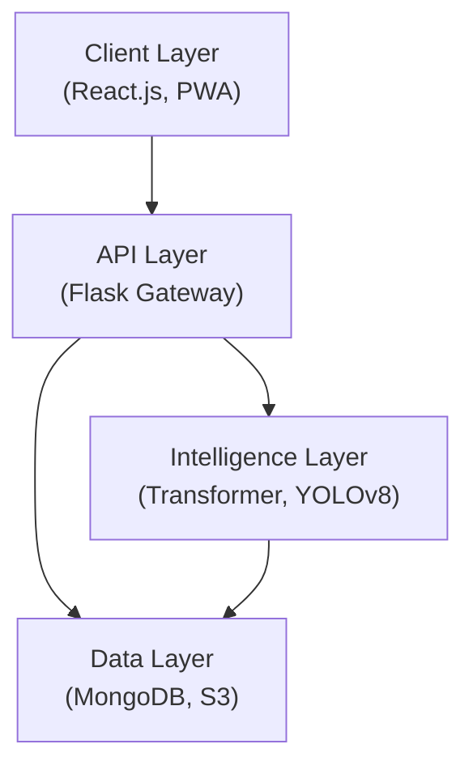

# System Design Document (SDD)

## Greencare AI: Personalized Plant Recommendation and Gardening Assistant

**Version:** 1.0  
**Date:** 27 January 2026

---

## 1. Introduction

### 1.1 Purpose

This document provides a comprehensive system design for Greencare AI, detailing the architecture, components, and deployment strategy.

### 1.2 Architecture Decision

A **Micro-modular architecture** was chosen to:

- Separate heavy AI processing (YOLO/Transformer) from the lightweight user interface
- Enable independent scaling of components
- Allow for easy maintenance and updates
- Support multiple client platforms (Web, Mobile PWA)

---

## 2. System Architecture Overview



---

## 3. Design Views

### 3.1 Use Case View

See: [Use_Case_Diagram.md](./Use_Case_Diagram.md)

**Key Actors:**

- Gardener (End User)
- System Admin
- AI Engine (System)

**Primary Use Cases:**

1. Submit Environmental Data → Get Recommendations
2. Upload Plant Image → View Disease Diagnosis → Get Remedy

### 3.2 Logical View

See: [Class_Diagram.md](./Class_Diagram.md)

**Core Classes:**
| Class | Purpose |
|-------|---------|
| User | Authentication & profile management |
| SoilProfile | Environmental data storage |
| Plant | Plant information & care instructions |
| Disease | Disease details & remedies |
| Recommendation | AI-generated suggestions |
| DiagnosisReport | Disease detection results |

### 3.3 Process View

See: [Sequence_Diagram.md](./Sequence_Diagram.md) and [Activity_Diagram.md](./Activity_Diagram.md)

**Key Flows:**

1. **Plant Recommendation:** User inputs → Validation → Transformer model → Top 3 results
2. **Disease Diagnosis:** Image upload → Validation → YOLOv8 → Diagnosis + Remedy

### 3.4 Development View

See: [Component_Diagram.md](./Component_Diagram.md)

**Components:**
| Layer | Components |
|-------|------------|
| Frontend | React.js Web UI, PWA Mobile |
| Backend | Flask API Gateway, Auth, Recommendation, Diagnosis services |
| AI | Transformer Model, YOLOv8, SHAP Explainer |
| Data | MongoDB Atlas, AWS S3, Redis Cache |

### 3.5 Physical View

See: [Deployment_Diagram.md](./Deployment_Diagram.md)

**Infrastructure:**

- **Client:** Modern browsers (Chrome 90+, Firefox 88+, Safari 14+)
- **Server:** AWS EC2 (t3.large) with Docker containers
- **Database:** MongoDB Atlas (M10 tier)
- **Storage:** AWS S3 for images
- **CDN:** CloudFront for static assets

---

## 4. Technology Stack

| Category          | Technology  | Justification                        |
| ----------------- | ----------- | ------------------------------------ |
| Frontend          | React.js    | Component-based, large ecosystem     |
| Backend           | Flask       | Lightweight, Python ML integration   |
| ML Recommendation | Transformer | State-of-the-art for structured data |
| ML Diagnosis      | YOLOv8      | Real-time object detection           |
| Database          | MongoDB     | Flexible schema for plant data       |
| Storage           | AWS S3      | Scalable image storage               |
| Deployment        | Docker      | Container consistency                |
| Orchestration     | Airflow     | ML pipeline automation               |

---

## 5. API Design

### 5.1 Authentication

```
POST /api/auth/register
POST /api/auth/login
GET  /api/auth/profile
```

### 5.2 Recommendation

```
POST /api/recommend
Body: { "nitrogen": 40, "phosphorus": 60, "potassium": 50, "ph": 6.5, "temperature": 28 }
Response: { "plants": [...], "confidence": [...] }
```

### 5.3 Diagnosis

```
POST /api/diagnose
Body: FormData with image file
Response: { "disease": "Leaf Blight", "confidence": 0.92, "remedy": "..." }
```

---

## 6. Security Considerations

| Aspect           | Implementation                     |
| ---------------- | ---------------------------------- |
| Authentication   | JWT tokens with 1-hour expiry      |
| Authorization    | Role-based access (User, Admin)    |
| Data Encryption  | HTTPS/TLS 1.3                      |
| Image Privacy    | Pre-signed S3 URLs (1-hour expiry) |
| Input Validation | Server-side sanitization           |

---

## 7. Performance Targets

| Metric                 | Target             |
| ---------------------- | ------------------ |
| Recommendation Latency | < 2 seconds        |
| Diagnosis Latency      | < 3 seconds        |
| Uptime                 | 99% during daytime |
| Concurrent Users       | 100+               |
