# Use Case Diagram

## Greencare AI

### Actors

- **Gardener:** The end-user seeking plant advice
- **System Admin:** Manages the plant database
- **AI Engine:** Internal actor processing the data (system boundary)

### Use Cases

| ID   | Use Case                  | Actor    | Description                           |
| ---- | ------------------------- | -------- | ------------------------------------- |
| UC-1 | Manage User Profile       | Gardener | Create, update, view profile          |
| UC-2 | Submit Environmental Data | Gardener | Input N, P, K, pH, temperature        |
| UC-3 | View Recommended Plants   | Gardener | Get top 3 plant suggestions           |
| UC-4 | Upload Plant Image        | Gardener | Upload leaf/plant photo for diagnosis |
| UC-5 | View Disease Diagnosis    | Gardener | See disease detection results         |
| UC-6 | View Remedy               | Gardener | Get treatment suggestions             |
| UC-7 | Manage Plant Database     | Admin    | Add/edit plant information            |

### Use Case Relationships

- **Include:** "Upload Plant Image" includes "Validate Image Format"
- **Extend:** "View Remedy" extends "View Disease Diagnosis" (only if disease is found)

---

## Use Case Diagram

```mermaid
graph LR
    subgraph "System Boundary: Greencare AI"
        UC1["UC-1: Manage User Profile"]
        UC2["UC-2: Submit Environmental Data"]
        UC3["UC-3: View Recommended Plants"]
        UC4["UC-4: Upload Plant Image"]
        UC5["UC-5: View Disease Diagnosis"]
        UC6["UC-6: View Remedy"]
        UC7["UC-7: Manage Plant Database"]

        VAL["Validate Image Format"]
    end

    G[/"🧑‍🌾 Gardener"\]
    A[/"👨‍💼 Admin"\]
    AI[/"🤖 AI Engine"\]

    G --> UC1
    G --> UC2
    G --> UC3
    G --> UC4
    G --> UC5
    G --> UC6
    A --> UC7

    UC4 -.->|include| VAL
    UC5 -.->|extend| UC6

    UC3 --> AI
    UC5 --> AI
```

---

## UC-5: View Disease Diagnosis (Detailed)

| Attribute            | Description                                                                         |
| -------------------- | ----------------------------------------------------------------------------------- |
| **Preconditions**    | User is logged in, Image uploaded successfully                                      |
| **Main Flow**        | 1. System sends image to API 2. API runs YOLO model 3. System displays result |
| **Alternative Flow** | Image unclear → System requests re-upload                                           |
| **Postconditions**   | Diagnosis result displayed to user                                                  |
